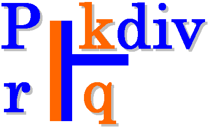

==================
 kdiv user manual
==================

+-------------------+----------------------------------------------------------+
| **Title**         | kdiv (Constant division routine generator)               |
+-------------------+----------------------------------------------------------+
| **Author**        | Nikolaos Kavvadias                                       |
+-------------------+----------------------------------------------------------+
| **Contact**       | nikos@nkavvadias.com                                     |
|                   |                                                          |
|                   | nikolaos.kavvadias@gmail.com                             |
+-------------------+----------------------------------------------------------+
| **Website**       | http://www.nkavvadias.com                                |
+-------------------+----------------------------------------------------------+
| **Release Date**  | 29 November 2014                                         |
+-------------------+----------------------------------------------------------+
| **Version**       | 0.1.1                                                    |
+-------------------+----------------------------------------------------------+
| **Rev. history**  |                                                          |
+-------------------+----------------------------------------------------------+
|        **v0.1.1** | 2014-11-29                                               |
|                   |                                                          |
|                   | Added project logo in README.                            |
+-------------------+----------------------------------------------------------+
|        **v0.1.0** | 2014-10-16                                               |
|                   |                                                          |
|                   | Documentation updates and fixes.                         |
+-------------------+----------------------------------------------------------+
|        **v0.0.9** | 2014-06-13                                               |
|                   |                                                          |
|                   | Renamed README to README.rst.                            |
+-------------------+----------------------------------------------------------+
|        **v0.0.8** | 2014-06-12                                               |
|                   |                                                          |
|                   | Updated contact information. Replaced COPYING.BSD by     |
|                   | LICENSE.                                                 |
+-------------------+----------------------------------------------------------+
|        **v0.0.7** | 2013-04-28                                               |
|                   |                                                          |
|                   | Converted documentation to RestructuredText.             |
+-------------------+----------------------------------------------------------+
|        **v0.0.6** | 2012-03-17                                               |
|                   |                                                          |
|                   | Split build-and-test scripts to ``build`` and ``test``.  |
+-------------------+----------------------------------------------------------+
|        **v0.0.5** | 2011-12-03                                               |
|                   |                                                          |
|                   | Minor README updates regarding multiple releases,        |
|                   | tutorial usage.                                          |
+-------------------+----------------------------------------------------------+
|        **v0.0.4** | 2011-11-20                                               |
|                   |                                                          |
|                   | Minor README, Makefile updates.                          |
+-------------------+----------------------------------------------------------+
|        **v0.0.3** | 2011-11-09                                               |
|                   |                                                          |
|                   | Added omitted constant value for M in C routines.        |
+-------------------+----------------------------------------------------------+
|        **v0.0.2** | 2011-09-16                                               |
|                   |                                                          |
|                   | Small fixes, avoids emitting redundant shift.            |
+-------------------+----------------------------------------------------------+
|        **v0.0.1** | 2011-05-21                                               |
|                   |                                                          |
|                   | Initial release.                                         |
+-------------------+----------------------------------------------------------+

.. _Link: http://to-be-determined

1. Introduction
===============

``kdiv`` is a generator for routines for optimized division by an integer 
constant. It can be used for calculating an integer division with the routines
presented in Henry S. Warren's "Hacker's Delight" book. ``kdiv`` can also be 
used for emitting a NAC (generic assembly language) or ANSI C implementation of 
the division.

2. File listing
===============

The ``kdiv`` distribution includes the following files:

+---------------------+--------------------------------------------------------+
| /kdiv               | Top-level directory                                    |
+---------------------+--------------------------------------------------------+
| LICENSE             | Description of the Modified BSD license.               |
+---------------------+--------------------------------------------------------+
| Makefile            | Makefile for generating the ``kdiv`` executable.       |
+---------------------+--------------------------------------------------------+
| README.html         | HTML version of README.rst.                            |
+---------------------+--------------------------------------------------------+
| README.pdf          | PDF version of README.rst.                             |
+---------------------+--------------------------------------------------------+
| README.rst          | This file.                                             |
+---------------------+--------------------------------------------------------+
| build.sh            | Build script for ``kdiv``.                             |
+---------------------+--------------------------------------------------------+
| kdiv.c              | The source code for the application.                   |
+---------------------+--------------------------------------------------------+
| kdiv.png            | PNG image for the ``kdiv`` project logo.               |
+---------------------+--------------------------------------------------------+
| rst2docs.sh         | Bash script for generating the HTML and PDF versions.  |
+---------------------+--------------------------------------------------------+
| test.c              | Sample test file.                                      |
+---------------------+--------------------------------------------------------+
| test.opt.c          | Expected optimized version of ``test.c``.              |
+---------------------+--------------------------------------------------------+
| test.sh             | Perform some sample runs.                              |
+---------------------+--------------------------------------------------------+

3. Installation
===============

There exists a quite portable Makefile (``Makefile`` in the current directory).
Running ``make`` from the command prompt should compile ``kdiv``.

4. Prerequisites
================

- [mandatory for building] Standard UNIX-based tools
- gcc (tested with gcc-3.4.4 on cygwin/x86)
- make
- bash

5. kdiv usage
=============

The ``kdiv`` program can be invoked with several options (see complete option 
listing below). The usual tasks that can be accomplished with ``kdiv`` are:

- test signed/unsigned division by constant
- generate a NAC optimized software routine for the division
- generate an ANSI C optimized software routine for the division.

ANSI C routines have been tested only for a width of 32-bits (see option 
below).

``kdiv`` can be invoked as:

| ``$./kdiv [options]``

The complete ``kdiv`` options listing:

**-h**
  Print this help.
  
**-d**
  Enable debug/diagnostic output.
  
**-errors**
  Report only inconsistencies to the expected division results.
  
**-div <num>**
  Set the value of the divisor (an integer except zero). 
  Default: 1.
  
**-width <num>**
  Set the bitwidth of all operands: dividend, divisor and quotient. 
  Default: 32.

**-lo <num>**
  Set the lower integer bound for dividend testing. Debug output (``-d``) 
  must be enabled. Default: 0.

**-hi <num>**
  Set the higher integer bound for dividend testing. Debug output (``-d``) 
  must be enabled. Default: 65535.
  
**-signed**
  Construct optimized routine for signed division.

**-unsigned**
  Construct optimized routine for unsigned division (default).
  
**-nac**
  Emit software routine in the NAC general assembly language (default).
  
**-ansic**
  Emit software routine in ANSI C (only for ``width=32``).

Here follow some simple usage examples of ``kdiv``.

1. Generate the ANSI C implementation of n/11 optimized routine.

| ``$ ./kdiv -div 11 -width 32 -unsigned -ansic``
  
2. Generate the NAC implementation of n/(-7) optimized routine.

| ``$ ./kdiv -div -7 -width 32 -signed -ansic``
  
3. Generate the ANSI C implementation of n/23 optimized routine. 
Also run some tests with an internal generator for the dividend 
range [0..1024].

| ``$ ./kdiv -div 23 -width 32 -unsigned -ansic -d -lo 0 -hi 1024``

6. Quick tutorial
=================

``kdiv`` can be used for arithmetic optimizations in user programs. Assume 
the following user program (``test.c``):

::

  // test.c
  #include <stdio.h>
  #include <stdlib.h>
  int main(int argc, char *argv[]) {
    int a, b;
    a = atoi(argv[1]);
    b = a / 23;
    printf("b = %d\n", b);
    return b;
  }

This file is compiled and run as follows with one additional argument:

| ``$ gcc -Wall -O2 -o test.exe test.c``
| ``$ ./test.exe 155``

and the expected result is:

| ``$ b = 6``

The user can apply ``kdiv`` for generating a constant division routine for ``a/23``:

| ``$ ./kdiv -div 23 -width 32 -signed -ansic``
  
and the corresponding routine is produced. Then, the user should edit a new 
file, let's say ``test.opt.c`` and include the produced routine. The resulting 
optimized source file should be as follows:

::

  // test.opt.c
  #include <stdio.h>
  #include <stdlib.h>
  inline signed int kdiv_s32_p_23 (signed int n)
  {
    signed int q, M=-1307163959, c;
    signed long long int t, u, v;
    t = (signed long long int)M * (signed long long int)n;
    q = t >> 32;
    q = q + n;
    q = q >> 4;
    c = n >> 31;
    q = q + c;
    return (q);
  }

  int main(int argc, char *argv[]) {
    int a, b;
    a = atoi(argv[1]);
    b = kdiv_s32_p_23(a);
    printf("b = %d\n", b);
    return b;
  }

This file is compiled and run as follows with one additional argument:

| ``$ gcc -Wall -O2 -o test.opt.exe test.opt.c``
| ``$ ./test.opt.exe 155``
 
The target platform compiler (e.g. ``gcc`` or ``llvm``) is expected to inline the 
``kdiv_s32_p_23`` function at its call site.

7. Running tests
================

In order to build and run a series of sample tests do the following:

| ``$ ./build.sh``
| ``$ ./test.sh``

